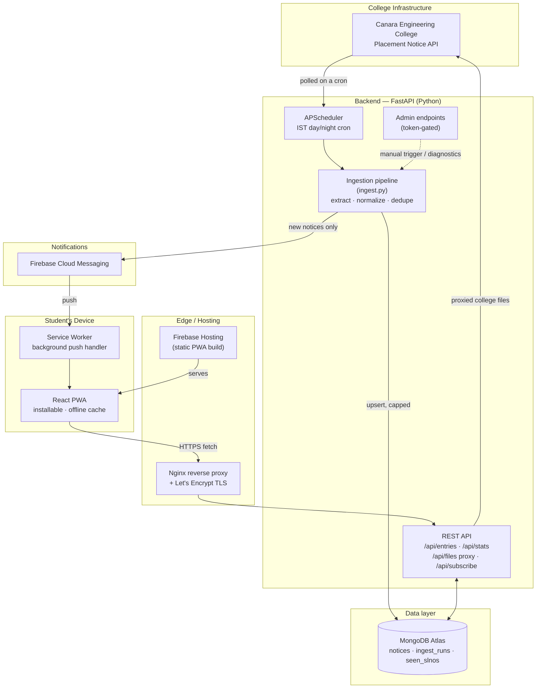

# 🎓 Placement Pulse

**A full-stack placement notification platform for Canara Engineering College.**
Automatically aggregates campus placement drives from the college's own
notice board, cleans and categorizes them, and delivers real-time push
notifications to students through an installable Progressive Web App —
so no one has to keep refreshing a website to catch a drive before
registration closes.

🔗 **Live app:** [cec-placements23.web.app](https://cec-placements23.web.app)

---

## Table of Contents

- [Why this exists](#why-this-exists)
- [Features](#features)
- [Architecture](#architecture)
- [Tech stack](#tech-stack)
- [Project structure](#project-structure)
- [API reference](#api-reference)
- [Local development](#local-development)
- [Deployment](#deployment)
- [Environment variables](#environment-variables)
- [Credits](#credits)

---

## Why this exists

The college's placement notices are published on a plain internal
notice board with no filtering, no search, no notifications, and
inconsistent formatting — students either had to check it manually
every day or risk missing a drive with a same-day deadline. Placement
Pulse polls that source automatically, extracts the information that
actually matters (company, CTC, eligible branches, registration
deadline, attachment links), and pushes a notification the moment a
genuinely new drive is posted.

## Features

### Ingestion & data quality
- **Smart, load-aware scheduler.** Polls the college's placement API
  every 30 minutes during the day (8 AM – 11:59 PM IST) and every 2
  hours overnight (12 AM – 7:59 AM IST) — frequent enough that a drive
  is never missed, while deliberately backing off overnight to avoid
  unnecessary load on the college's own server.
- **Company name extraction** with layered fallbacks: the source
  field itself, a trimmed headline, or the first meaningful link in
  the notice body — validated so raw emails, form URLs, or generic
  boilerplate never get shown as a "company."
- **Attachment labeling that matches the official portal.** When the
  college's own notice gives a link a real label ("Registered
  Students List", "Eligibility Criteria"), that exact label is shown
  — not a re-guessed one. Duplicate destinations are deduplicated,
  and repeated labels are numbered (`JD 1`, `JD 2`, ...) instead of
  rendering as identical, indistinguishable buttons.
- **College-hosted attachments are proxied** through the backend
  (`/api/files/{slno}/{index}`) so a student's browser never talks to
  the college's raw site directly.
- **Structured extraction** of CTC/stipend, eligible branches, notice
  type (drive / internship / results / PPT / notice), and registration
  deadline — parsed once at ingest time and persisted, so the frontend
  never re-parses HTML on every render.
- **Bounded storage.** The notice collection is automatically trimmed
  to the most recent 100 entries every run — no unbounded growth, no
  separate cleanup job required.
- **Resilient error monitoring.** Discord webhook alerts fire
  automatically on ingest failures or database unreachability, so a
  broken poll surfaces immediately instead of silently going stale.

### Notifications
- **Push notifications via Firebase Cloud Messaging**, with the real
  company name and deadline in the notification itself (not a generic
  "new notice" ping).
- **Branch-specific targeting** — students can subscribe to "all
  branches" or customize down to specific ones; a student subscribed
  to multiple branches still gets exactly one notification per notice,
  never a duplicate.
- **Burst protection** — if an unusually large number of genuinely new
  notices land in a single poll, individual pushes collapse into one
  summary notification instead of spamming a device.
- **Recycle-proof.** Notification eligibility is tracked independently
  of the (capped, trimmed) notice storage — a notice that cycles back
  into view because of the storage cap is never treated as "new"
  again.

### Frontend (Progressive Web App)
- **Cross-platform installable PWA** — a native install prompt on
  Android, and full support for iOS 16.4+ via "Add to Home Screen,"
  with platform-aware onboarding that walks iOS users through the
  manual steps Apple requires instead of silently failing to prompt.
- **Bookmarks are permanent**, independent of the 100-notice display
  cap — bookmarking a drive keeps it fully viewable and functional in
  the Bookmarks view even after it ages out of the main feed.
- **Dynamic month sections** — only months that actually contain
  drives are shown; a month with zero notices simply never renders,
  and starts appearing automatically the moment its first notice
  lands, rather than showing a fixed empty Jan–Dec scaffold.
- **Month → week-of-month pagination**, so within the current month
  you page week by week rather than scrolling one long list, and the
  current week is always the default landing page.
- **Filtering**: free-text search, branch multi-select, company,
  notice type, registration status, and week — all composable.
- **Sorting**: newest, company A–Z, or soonest-closing.
- **Install prompt** guiding first-time visitors through adding the
  app to their home screen.
- **Error boundary** around the app shell, so a rendering failure in
  one part of the UI shows a graceful fallback instead of a blank
  white screen.
- **Notification bell** with an in-place branch picker — subscribe,
  edit branches, or unsubscribe without re-prompting for permission or
  rotating the device's push token.
- **Unread tracking** and a "jump to current week" chip with a live
  unread count.

### API & operations
- Rate-limited public REST API (`slowapi`) so the unauthenticated
  read endpoints can't be trivially hammered.
- Token-gated admin surface (`X-Admin-Token`) for manual ingest
  triggers, backfills, and diagnostics — disabled entirely (503) if no
  admin token is configured, rather than defaulting open.
- `/api/health` liveness endpoint reporting Mongo connectivity,
  scheduler status, and the last poll's outcome — used for container
  health checks.
- Optional Discord webhook alerting on ingest failures or database
  unreachability.

## Architecture



**Deployment note:** the backend currently runs as a Docker container
on an EC2 instance (behind Nginx + Let's Encrypt, on a static Elastic
IP), with MongoDB Atlas as the database and the frontend on Firebase
Hosting. A serverless AWS Lambda deployment path (API Gateway +
EventBridge Scheduler in place of the in-process scheduler) is also
prepared in `backend/lambda_handler.py` and
`scripts/build-lambda-zip.sh` as an alternative, not currently in use.

## Tech stack

| Layer | Technology |
|---|---|
| Backend | Python, FastAPI, Motor (async MongoDB driver), APScheduler, httpx, BeautifulSoup |
| Database | MongoDB Atlas |
| Push notifications | Firebase Cloud Messaging (Firebase Admin SDK) |
| Frontend | React, Tailwind CSS, shadcn/ui, IndexedDB (via `idb`), Workbox-style service worker |
| Hosting | Firebase Hosting (frontend), Docker on EC2 + Nginx + Let's Encrypt (backend) |
| Rate limiting | slowapi |
| Alternative deploy target | AWS Lambda + API Gateway + EventBridge Scheduler |

## Project structure

```
.
├── backend/
│   ├── server.py            # FastAPI app, routes, scheduler wiring
│   ├── ingest.py             # Polling, extraction, normalization, dedupe
│   ├── firebase_client.py    # FCM publish / subscribe (lazy singleton)
│   ├── lambda_handler.py     # AWS Lambda entry points (API + poller)
│   ├── discord_notify.py     # Optional failure alerting
│   ├── requirements.txt
│   └── secrets/               # gitignored — service-account credentials
├── frontend/
│   ├── src/
│   │   ├── pages/             # Home, EntryDetail
│   │   ├── components/        # EntryCard, FilterBar, NotificationBell, ...
│   │   └── lib/                # firebase.js, db.js (IndexedDB), pwa.js
│   └── public/
│       └── firebase-messaging-sw.js
├── scripts/
│   └── build-lambda-zip.sh    # Lambda deployment package builder
├── Dockerfile.backend          # EC2/container deployment
└── memory/                     # Project planning docs (PRD, architecture, phases)
```

## API reference

All endpoints are prefixed with `/api`. Full request/response shapes
are in `backend/server.py`.

| Endpoint | Method | Auth | Purpose |
|---|---|---|---|
| `/health` | GET | none | Liveness + last-poll snapshot |
| `/entries` | GET | none, rate-limited | List notices — filterable by week, company, search, type, registration status |
| `/entries/{slno}` | GET | none, rate-limited | Full detail for one notice |
| `/files/{slno}/{index}` | GET | none, rate-limited | Streams a college-hosted attachment through the backend |
| `/stats` | GET | none, rate-limited | Header-strip counters (totals, this week, top companies) |
| `/subscribe` | POST | none | Bind a device's FCM token to base + selected branch topics |
| `/unsubscribe` | POST | none | Unbind a device's FCM token |
| `/subscribe/branches` | POST | none | Reconcile a device's branch subscriptions in place |
| `/admin/ingest/run` | POST | `X-Admin-Token` | Trigger a manual poll |
| `/admin/notify/test` | POST | `X-Admin-Token` | Send a test push (optionally using a real notice's content) |
| `/admin/notices/trim` | POST | `X-Admin-Token` | Immediately trim storage to a given cap |
| `/admin/reprocess` | POST | `X-Admin-Token` | Re-derive badge fields on already-stored notices |

## Local development

See [`localsetup.md`](./localsetup.md) for the full walkthrough
(virtual environment, MongoDB connection, Firebase service account,
running the backend and frontend dev servers side by side).

Quick start:
```bash
# Backend
cd backend
python -m venv .venv && source .venv/bin/activate
pip install -r requirements.txt
uvicorn server:app --reload --port 8001

# Frontend
cd frontend
yarn install
yarn start
```

## Deployment

**Current (EC2 + Docker):**
```bash
docker build -t placement-pulse-backend -f Dockerfile.backend .
docker run -d --name pp-backend --restart unless-stopped \
  -p 127.0.0.1:8001:8001 --env-file backend/.env \
  -v $(pwd)/backend/secrets:/app/backend/secrets:ro \
  placement-pulse-backend
```
Nginx terminates HTTPS in front of the container; see
`Dockerfile.backend`'s header comment for the full run command and
health-check details.

**Frontend:**
```bash
cd frontend
yarn build
firebase deploy --only hosting
```

**Alternative (AWS Lambda):** see `backend/lambda_handler.py`'s module
docstring for the two-function (API + scheduled poller) architecture
and `scripts/build-lambda-zip.sh` for the packaging step.

## Environment variables

Set via `backend/.env` (local/EC2) or Lambda environment configuration
— never committed. Names only; see `server.py` / `firebase_client.py`
for how each is consumed.

| Variable | Purpose |
|---|---|
| `MONGO_URL` | MongoDB Atlas connection string |
| `DB_NAME` | Database name |
| `CORS_ORIGINS` | Comma-separated allowed frontend origins |
| `COLLEGE_API_URL` | Source placement API endpoint |
| `FCM_TOPIC` | Base FCM topic name |
| `FIREBASE_PROJECT_ID` | Firebase project ID |
| `FIREBASE_SERVICE_ACCOUNT_PATH` | Path to the service-account JSON |
| `FIREBASE_SECRET_NAME` | *(Lambda only)* Secrets Manager secret name, fetched at cold start |
| `ADMIN_TOKEN` | Gates all `/api/admin/*` routes |
| `DISCORD_WEBHOOK_URL` | *(optional)* Failure alerting |

Frontend equivalents (`frontend/.env`) mirror the Firebase web config
(`REACT_APP_FIREBASE_*`) plus `REACT_APP_BACKEND_URL` pointing at the
deployed API.

## Credits

Built by **Sumit-S23** — CS student, Canara Engineering
College.